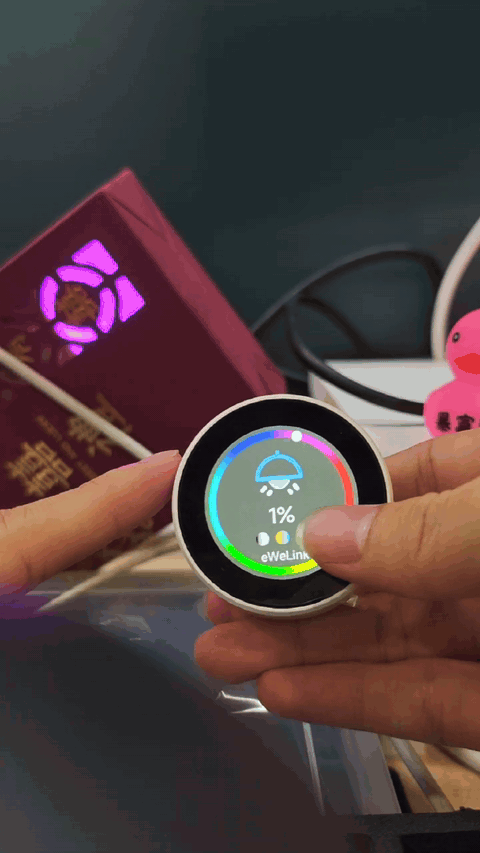

# OpenNextion ESPHome Knob Control

[简体中文](README.zh-CN.md)

ESPHome firmware project for the ONX2424G013 round knob display. It uses an ESP32-S3, ESP-IDF, LVGL, and bundled custom components to provide a local Home Assistant control panel.

## Demo

<p align="center">
  
</p>

## Features

- Controls Home Assistant switches, lights, plugs, covers, and automations from the display.
- Supports rotary and push-button input, screen brightness, standby settings, and standby weather.
- Provides Wi-Fi captive-portal provisioning when no network has been configured.
- Supports HTTPS manifest-based firmware updates; the current release OTA image is in `firmware/`.

The main configuration is [ONX2424G013.yaml](ONX2424G013.yaml). The target hardware uses an ESP32-S3 with 16 MB flash, Octal PSRAM, and a GC9A01A round display; use this firmware only with compatible ONX2424G013 hardware.

## Requirements

Build this project with **ESPHome 2026.6.3**. Docker is recommended to keep ESPHome, PlatformIO, and ESP-IDF versions consistent.

- Docker, or a local Python environment with `esphome==2026.6.3`
- Network access for the first build to download dependencies
- A data-capable USB cable for serial flashing

## Clone and build

Clone the complete repository first. The configuration depends on the included `packages`, `my_components`, `assets`, and `fonts` directories.

```bash
git clone https://github.com/OpenNextion/OpenNextion-Example-ESPHome_KNOB_Control.git
cd OpenNextion-Example-ESPHome_KNOB_Control
```

### Docker (recommended)

Linux/macOS:

```bash
docker run --rm \
  -v "$PWD":/config \
  -w /config \
  ghcr.io/esphome/esphome:2026.6.3 \
  compile ONX2424G013.yaml
```

Windows PowerShell:

```powershell
docker run --rm -v "${PWD}:/config" -w /config ghcr.io/esphome/esphome:2026.6.3 compile ONX2424G013.yaml
```

### Local ESPHome

```bash
python -m pip install "esphome==2026.6.3"
esphome version
esphome compile ONX2424G013.yaml
```

After a successful build, the factory image for browser-based first-time installation is `.esphome/build/onx2424g013/.pioenvs/onx2424g013/firmware.factory.bin`. For later serial uploads, use the firmware file reported by the ESPHome build output.

## Flash over USB

Docker is the recommended way to compile and flash this project. You do not need to install ESPHome locally when flashing with Docker or ESPHome Web.

### Docker (recommended, Linux)

Pass the actual serial device through to the container. The following command compiles the project if needed and uploads it:

```bash
docker run --rm \
  --device=/dev/ttyACM0 \
  -v "$PWD":/config \
  -w /config \
  ghcr.io/esphome/esphome:2026.6.3 \
  run --device /dev/ttyACM0 ONX2424G013.yaml
```

Replace `/dev/ttyACM0` with the serial port of your device. If the device does not enter download mode automatically, hold `BOOT` (GPIO0), tap `RESET` if available, then release `BOOT` when upload starts. Restart the device after uploading completes.

### Local ESPHome CLI

If you installed `esphome==2026.6.3` locally as described above, connect the device and run the following command. It compiles the firmware when needed and uploads it. When prompted, select the corresponding serial port, for example `/dev/ttyACM0` or `/dev/ttyUSB0` on Linux, or `COM3` on Windows:

```bash
esphome run ONX2424G013.yaml
```

Specify the serial port if necessary:

```bash
esphome run --device /dev/ttyACM0 ONX2424G013.yaml
```

## Browser installation (first-time flash)

For browser flashing, open [ESPHome Web](https://web.esphome.io/) in Chrome or Edge, connect the device, and select a factory firmware file. This method requires a Chromium-based browser with Web Serial support, but does not require a local ESPHome installation.

- **Build from source:** select `.esphome/build/onx2424g013/.pioenvs/onx2424g013/firmware.factory.bin` after compiling the repository.
- **No local build:** download `onx2424g013.factory_v1.0.1.bin` from the [v1.0.1 release](https://github.com/OpenNextion/OpenNextion-Example-ESPHome_KNOB_Control/releases/tag/v1.0.1), then select that file in ESPHome Web.

## User manual

For device setup, Wi-Fi provisioning, Home Assistant integration, screen operation, and OTA updates, see the [online user manual](https://opennextion.github.io/OpenNextion-Example-ESPHome_KNOB_Control/).

## Project layout

- `ONX2424G013.yaml`: main ESPHome configuration.
- `packages/`: split device, connectivity, display, input, and feature configuration.
- `my_components/`: local ESPHome components.
- `assets/` and `fonts/`: UI assets and fonts.
- `docs/`: README demonstration media.
- `firmware/`: release OTA image and manifest.
- `User Manual/`: bundled web user manual.

## Troubleshooting

- **Serial port is not detected:** Use a data-capable USB cable, confirm that the operating system sees the serial device, and close any application using that port.
- **Assets or components cannot be found during compilation:** Run commands from the root of the cloned repository and retain all project directories.
